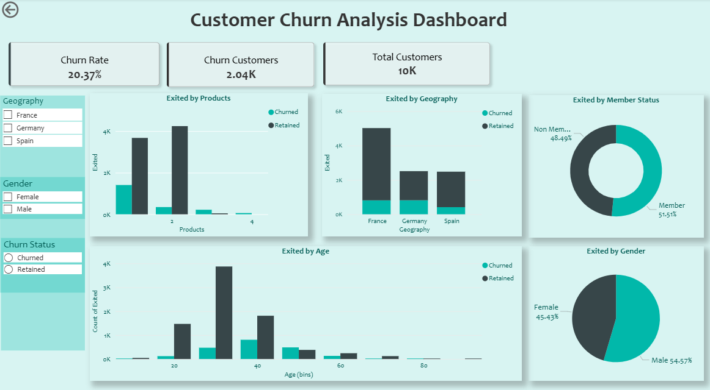

# Customer Churn Analysis Dashboard

## Overview

This project analyzes customer churn behavior in a banking dataset using Python and Power BI. The goal is to identify customer segments with higher churn tendencies, understand key factors influencing customer attrition, and provide insights that support customer retention strategies.

## Objectives

* Analyze customer churn patterns and behavior.
* Identify factors associated with customer attrition.
* Compare churn rates across different customer segments.
* Develop an interactive dashboard for business monitoring and decision-making.

## Dataset Information

* Total Records: 10,000 Customers
* Industry: Banking
* Target Variable: Exited (Customer Churn)

### Dataset Features

* Customer ID
* Geography
* Gender
* Age
* Tenure
* Balance
* Number of Products
* Credit Score
* Active Membership Status
* Estimated Salary
* Exited (Churn Status)

## Tools & Technologies

* Python
* Pandas
* NumPy
* Power BI
* Microsoft Excel

## Data Preparation

The dataset underwent several preprocessing steps:

* Removed unnecessary columns.
* Handled missing and inconsistent values.
* Renamed and standardized column names.
* Converted categorical variables into analysis-ready formats.
* Created additional calculated fields for dashboard reporting.

## Exploratory Data Analysis (EDA)

The analysis focused on:

* Churn distribution
* Customer demographics
* Product ownership
* Geographic segmentation
* Membership status analysis
* Age group comparison

## Dashboard Features

* Total Customers KPI
* Churn Rate KPI
* Churned Customers KPI
* Active Customers KPI
* Churn by Geography
* Churn by Gender
* Churn by Product Ownership
* Churn by Membership Status
* Churn by Age Group
* Interactive Filters and Slicers

## Key Insights

* Customer churn rate reached 20.37%, indicating that approximately one in five customers left the bank.
* Customers with two products recorded the highest number of churn cases.
* Customer churn varied across geographic regions.
* Churn occurred across both member and non-member groups.
* Customers aged 30–40 represented a significant portion of churn activity.

## Repository Structure

```text
├── data/
│   ├── raw_churn_data.csv
│   └── cleaned_churn_data.csv
├── notebooks/
│   └── customer_churn_analysis.ipynb
├── dashboard/
│   └── Customer_Churn_Dashboard.pbix
├── images/
│   └── dashboard_preview.png
└── README.md
```

## Dashboard Preview




## Conclusion

This project demonstrates the complete data analytics workflow, from data cleaning and transformation to dashboard development and insight generation. The findings can help organizations better understand customer behavior and support data-driven customer retention strategies.

## Author

**Anisa Nur Fitri**

